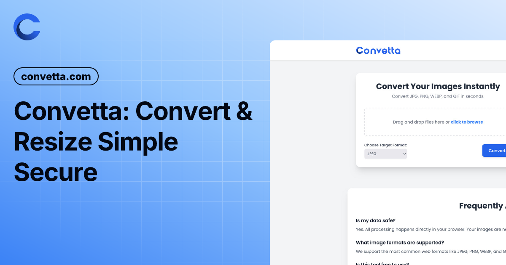
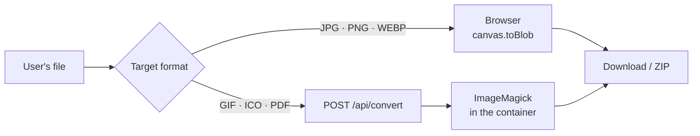

<div align="center">


# Convetta

**Free online image converter and resizer.**
JPG, PNG and WEBP conversions never leave your browser.

[](https://github.com/YakupEmreYerli/Convetta/actions/workflows/ci.yml)
[](LICENSE)
[](https://kit.svelte.dev)
[](package.json)

[**www.convetta.com/en**](https://www.convetta.com/en/) &nbsp;·&nbsp; [Resizer](https://www.convetta.com/en/resizer/) &nbsp;·&nbsp; [Privacy](https://www.convetta.com/en/privacy/) &nbsp;·&nbsp; [Türkçe](README.md)



</div>

---

## Contents

- [Why Convetta](#why-convetta)
- [How it works](#how-it-works)
- [Quick start](#quick-start)
- [Commands](#commands)
- [Project layout](#project-layout)
- [Conversion endpoint](#conversion-endpoint)
- [Deployment](#deployment)
- [Security](#security)
- [Contributing](#contributing)
- [License](#license)

## Why Convetta

| | |
|---|---|
| 🔒 **Private by default** | JPG, PNG and WEBP outputs are produced with `canvas` — the file never leaves the device. |
| 📦 **Batch work** | Convert many files at once and download them as a single ZIP. |
| 🖼️ **Resizer** | Aspect-ratio lock, resize by pixels or percentage. |
| 🌍 **Two languages** | Turkish is the default (`/`), English lives under `/en`; each page has its own canonical URL and hreflang tags. |
| 🌓 **Dark theme** | Follows the system preference, remembers the choice, no flash of unstyled content. |
| 🧩 **No account** | No sign-up, no quota, no tracking, no ads. |

Target formats: **JPG · PNG · WEBP · GIF · ICO · PDF**
Accepted inputs: JPEG, PNG, WEBP, GIF, BMP, AVIF — up to 20 MB per file.

## How it works

Conversion is split in two by whether the browser can produce the format:



| Layer | Formats | Where | Does the file reach the server |
|---|---|---|---|
| Browser (`src/lib/convert.ts`) | JPG, PNG, WEBP | Client, `canvas` | **No** |
| Server (`src/lib/server/magick.ts`) | GIF, ICO, PDF | ImageMagick, container | Yes — discarded as soon as the response is sent, never stored |

> [!NOTE]
> `canvas.toBlob` does not fail on an unsupported MIME type — it silently returns PNG.
> That is why `convert.ts` verifies the resulting `blob.type` and throws `ConversionError('encode')`
> on a mismatch. When adding a target format, keep the `CANVAS_FORMATS` / `SERVER_FORMATS`
> split in `src/lib/formats.ts` aligned with that trap.

## Quick start

Requires **Node ≥ 22**. To exercise GIF/ICO/PDF locally you also need **ImageMagick** (`magick`); without it those three formats return `501` and everything else works.

```bash
git clone https://github.com/YakupEmreYerli/Convetta.git
cd Convetta
npm install
npm run dev          # http://localhost:5173
```

To run the production output locally:

```bash
npm run build
npm start            # http://localhost:3000  (override with PORT)
```

## Commands

| Command | What it does |
|---|---|
| `npm run dev` | Vite dev server with hot reload |
| `npm run build` | `adapter-node` output in `build/`; pages are prerendered |
| `npm start` | `server/index.js` — production entry (needs `build/`) |
| `npm run preview` | SvelteKit's own preview server |
| `npm run check` | `svelte-kit sync` + `svelte-check` (type checking) |
| `npm test` | Vitest over `src/**/*.test.ts` |

Single file: `npx vitest run src/lib/convert.test.ts` — single test: `npx vitest run -t "test name"`.

## Project layout

```
src/
├─ routes/
│  ├─ [[lang=locale]]/          converter, /resizer, /privacy — prerendered
│  │  └─ ...                    Turkish unprefixed (/), English under /en
│  ├─ api/convert/+server.ts    GIF · ICO · PDF endpoint (runtime)
│  └─ +layout.svelte            shell, theme, locale
├─ lib/
│  ├─ convert.ts resize.ts      pure conversion logic — the core of the test suite
│  ├─ formats.ts                canvas / server format split
│  ├─ components/               Svelte 5 components
│  ├─ i18n/                     en.ts defines the schema, tr.ts is derived from it
│  ├─ server/                   ImageMagick wrapper + rate limiting
│  └─ state/                    `*.svelte.ts` — rune-based state
├─ hooks.server.ts              security headers on SSR responses
└─ params/locale.ts             `[[lang=locale]]` matcher

server/                         production entry (replaces adapter-node's)
├─ index.js                     http server + graceful shutdown
├─ canonical.js                 non-www → www 301
└─ security.js                  single source for security headers

static/                         fonts, icons, robots.txt, sitemaps
```

`src/lib/i18n/en.ts` also defines the dictionary schema: adding a key there makes `tr.ts` fail to compile, so a translation can never be forgotten.

## Conversion endpoint

```http
POST /api/convert?format=gif|ico|pdf
Content-Type: application/octet-stream

<raw binary image data>
```

The body is **raw binary, not multipart**. No multipart parser is kept on the server, which removes that attack surface entirely.

| Status | Meaning |
|---|---|
| `200` | Converted image; `Cache-Control: no-store, private` |
| `400` | Empty body or unsupported target format |
| `413` | Over the 20 MB limit |
| `415` | Input is not a valid raster image |
| `429` | Over 30 requests per minute per IP |
| `501` | Encoder not installed on the server |
| `503` | All concurrent conversion slots are busy |

The input type is validated from the **leading bytes, not the file name** (`sniffImageType`), so only raster images ever reach ImageMagick — Ghostscript is present in the image, which makes rejecting PDF/PS input a security requirement.

## Deployment

```bash
docker build -t convetta .
docker run --rm -p 8787:8787 convetta
```

Two-stage build: the npm tree and the compile step stay in the `builder` layer; the running image holds only `build/`, production dependencies and ImageMagick. The container runs as the non-root `node` user with a read-only application directory.

**Encoder verification:** a missing ImageMagick encoder does not error — it silently produces empty output. The Dockerfile therefore verifies write support for `PNG JPEG WEBP GIF ICO PDF` at build time and fails the build if one is missing. When adding a format, update both that list and the matching `imagemagick-<format>` apk package.

<details>
<summary><b>Dokploy settings</b></summary>

| Setting | Value |
|---|---|
| Build type | Dockerfile |
| Dockerfile path | `Dockerfile` |
| Port | `8787` |
| Domain | `www.convetta.com` **and** `convetta.com` (both to the same app) |

`convetta.com` must also point at the app: the non-www → www 301 lives in `server/canonical.js`, so the redirect never runs if that domain is not attached. Traefik terminates HTTPS and forwards `X-Forwarded-Proto`, so the app listens on plain HTTP inside the container.

</details>

**Environment variables**

| Variable | Default | Description |
|---|---|---|
| `PORT` | `3000` (`8787` in Docker) | Listening port |
| `HOST` | `0.0.0.0` | Listening interface |
| `BODY_SIZE_LIMIT` | `21M` | adapter-node limit, sized for 20 MB uploads |
| `SHUTDOWN_TIMEOUT` | `8` | Seconds to wait after SIGTERM |

## Security

- **Security headers** come from a single source (`server/security.js`) and are applied in two places: the server entry (which covers prerendered pages) and the SvelteKit hook (which covers the dev server).
- **CSP** is `default-src 'self'` plus `object-src 'none'`. `unsafe-inline` exists only for SvelteKit's hydration data and the FOUC-preventing theme script — both our own code.
- **Limits:** 20 MB body, 30 requests per minute per IP, a bounded number of concurrent conversions.
- **No retention:** conversion output is returned with `no-store, private` and nothing is written to disk (ICO's temp file goes to `/tmp` and is removed immediately).

Found a vulnerability? Please do not open an issue — follow [SECURITY.md](SECURITY.md).

## Contributing

Contributions are welcome. See [CONTRIBUTING.md](CONTRIBUTING.md); in short, if

```bash
npm run check && npm test
```

is green, open a PR. Note that code comments and documentation in this repo are written in Turkish.

## License

[GNU AGPL-3.0](LICENSE) © Yakup Emre Yerli

AGPL prevents taking this code and offering it as a closed-source service: if you run a modified version over a network, you must publish its source too.
