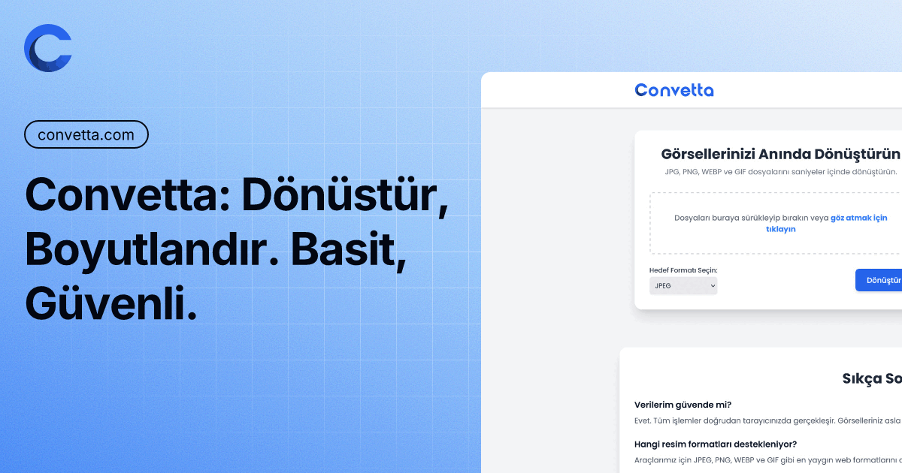
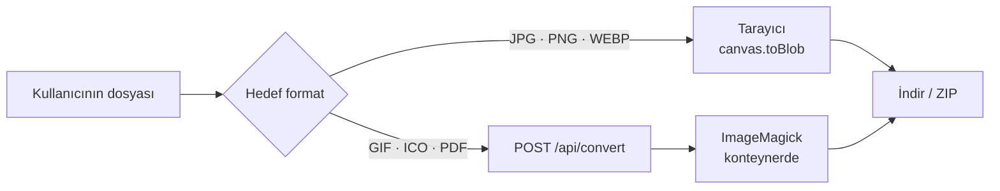

<div align="center">


# Convetta

**Ücretsiz online görsel dönüştürücü ve boyutlandırıcı.**
JPG, PNG ve WEBP dönüşümleri tarayıcıdan hiç çıkmaz.

[](https://github.com/YakupEmreYerli/Convetta/actions/workflows/ci.yml)
[](LICENSE)
[](https://kit.svelte.dev)
[](package.json)

[**www.convetta.com**](https://www.convetta.com) &nbsp;·&nbsp; [Boyutlandırıcı](https://www.convetta.com/resizer/) &nbsp;·&nbsp; [Gizlilik](https://www.convetta.com/privacy/) &nbsp;·&nbsp; [English](README.en.md)



</div>

---

## İçindekiler

- [Neden Convetta](#neden-convetta)
- [Nasıl çalışır](#nasıl-çalışır)
- [Hızlı başlangıç](#hızlı-başlangıç)
- [Komutlar](#komutlar)
- [Proje yapısı](#proje-yapısı)
- [Dönüştürme ucu](#dönüştürme-ucu)
- [Dağıtım](#dağıtım)
- [Güvenlik](#güvenlik)
- [Katkı](#katkı)
- [Lisans](#lisans)

## Neden Convetta

| | |
|---|---|
| 🔒 **Gizlilik varsayılan** | JPG, PNG ve WEBP çıktıları `canvas` ile üretilir; dosya cihazdan hiç çıkmaz. |
| 📦 **Toplu iş** | Birden çok dosyayı aynı anda dönüştür, hepsini tek ZIP olarak indir. |
| 🖼️ **Boyutlandırıcı** | En-boy oranı kilidi, piksel ya da yüzde ile yeniden boyutlandırma. |
| 🌍 **İki dil** | Türkçe varsayılan (`/`), İngilizce `/en` önekiyle; her sayfanın kendi kanonik adresi ve hreflang etiketi var. |
| 🌓 **Koyu tema** | Sistem tercihini izler, seçim `localStorage`'da kalır, FOUC yok. |
| 🧩 **Hesap yok** | Kayıt yok, kota yok, izleme yok, reklam yok. |

Desteklenen hedef formatlar: **JPG · PNG · WEBP · GIF · ICO · PDF**
Kabul edilen girdiler: JPEG, PNG, WEBP, GIF, BMP, AVIF — dosya başına en fazla 20 MB.

## Nasıl çalışır

Dönüşüm, formatın tarayıcıda üretilebilirliğine göre ikiye ayrılır:



| Katman | Formatlar | Nerede | Dosya sunucuya gider mi |
|---|---|---|---|
| Tarayıcı (`src/lib/convert.ts`) | JPG, PNG, WEBP | İstemci, `canvas` | **Hayır** |
| Sunucu (`src/lib/server/magick.ts`) | GIF, ICO, PDF | ImageMagick, konteyner | Evet — dönüşüm biter bitmez silinir, hiçbir yerde saklanmaz |

> [!NOTE]
> `canvas.toBlob`, desteklemediği bir MIME istendiğinde hata vermez — sessizce PNG döndürür.
> Bu yüzden `convert.ts` çıktının `blob.type` değerini doğrular ve uyuşmazsa `ConversionError('encode')` atar.
> Yeni bir hedef format eklerken `src/lib/formats.ts` içindeki `CANVAS_FORMATS` / `SERVER_FORMATS`
> ayrımını bu tuzağa göre koru.

## Hızlı başlangıç

Gereksinim: **Node ≥ 20**. GIF/ICO/PDF dönüşümlerini yerelde denemek için ayrıca **ImageMagick** (`magick`) gerekir; kurulu değilse o üç format `501` döner, geri kalan her şey çalışır.

```bash
git clone https://github.com/YakupEmreYerli/Convetta.git
cd Convetta
npm install
npm run dev          # http://localhost:5173
```

Üretim çıktısını yerelde çalıştırmak için:

```bash
npm run build
npm start            # http://localhost:3000  (PORT ile değiştirilebilir)
```

## Komutlar

| Komut | Ne yapar |
|---|---|
| `npm run dev` | Vite geliştirme sunucusu, sıcak yeniden yükleme |
| `npm run build` | `adapter-node` ile `build/` çıktısı; sayfalar önceden üretilir |
| `npm start` | `server/index.js` — üretim girdisi (`build/` gerekir) |
| `npm run preview` | SvelteKit'in kendi önizleme sunucusu |
| `npm run check` | `svelte-kit sync` + `svelte-check` (tip kontrolü) |
| `npm test` | Vitest, `src/**/*.test.ts` |

Tek dosya çalıştırma: `npx vitest run src/lib/convert.test.ts` — tek test: `npx vitest run -t "test adı"`.

## Proje yapısı

```
src/
├─ routes/
│  ├─ [[lang=locale]]/          dönüştürücü, /resizer, /privacy — önceden üretilir
│  │  └─ ...                    Türkçe öneksiz (/), İngilizce /en önekiyle
│  ├─ api/convert/+server.ts    GIF · ICO · PDF ucu (çalışma zamanı)
│  └─ +layout.svelte            kabuk, tema, dil
├─ lib/
│  ├─ convert.ts resize.ts      saf dönüşüm mantığı — testlerin çekirdeği
│  ├─ formats.ts                canvas / sunucu format ayrımı
│  ├─ components/               Svelte 5 bileşenleri
│  ├─ i18n/                     en.ts şemayı tanımlar, tr.ts ondan türetilir
│  ├─ server/                   ImageMagick sarmalayıcı + hız sınırı
│  └─ state/                    `*.svelte.ts` — rune tabanlı durum
├─ hooks.server.ts              SSR yanıtlarına güvenlik başlıkları
└─ params/locale.ts             `[[lang=locale]]` eşleştiricisi

server/                         üretim girdisi (adapter-node'un yerine)
├─ index.js                     http sunucusu + düzgün kapanma
├─ canonical.js                 non-www → www 301
└─ security.js                  güvenlik başlıklarının tek kaynağı

static/                         font, ikon, robots.txt, sitemap
```

`src/lib/i18n/en.ts` sözlük şemasını da tanımlar: yeni bir anahtar eklendiğinde `tr.ts` derleme hatası verir, böylece çeviri unutulamaz.

## Dönüştürme ucu

```http
POST /api/convert?format=gif|ico|pdf
Content-Type: application/octet-stream

<ham ikili görsel verisi>
```

Gövde **multipart değil, ham ikili**. Sunucuda multipart ayrıştırıcısı tutulmadığı için o saldırı yüzeyi tümüyle yok.

| Durum | Anlamı |
|---|---|
| `200` | Dönüştürülmüş görsel; `Cache-Control: no-store, private` |
| `400` | Boş gövde ya da desteklenmeyen hedef format |
| `413` | 20 MB sınırı aşıldı |
| `415` | Girdi geçerli bir raster görsel değil |
| `429` | IP başına dakikada 30 istek sınırı |
| `501` | Kodlayıcı sunucuda kurulu değil |
| `503` | Eşzamanlı dönüşüm yuvası dolu |

Girdi türü **dosya adına değil ilk baytlara** bakılarak doğrulanır (`sniffImageType`), böylece ImageMagick'e yalnızca raster görsel ulaşır — imajda Ghostscript kurulu olduğu için PDF/PS girdisini engellemek güvenlik açısından zorunlu.

## Dağıtım

```bash
docker build -t convetta .
docker run --rm -p 8787:8787 convetta
```

İki aşamalı build: npm ağacı ve derleme `builder` katmanında kalır, çalışan imajda yalnızca `build/`, üretim bağımlılıkları ve ImageMagick bulunur. Konteyner root olmayan `node` kullanıcısıyla, salt okunur uygulama dizininde çalışır.

**Kodlayıcı doğrulaması:** eksik bir ImageMagick kodlayıcısı hata vermez, sessizce boş çıktı üretir. Bu yüzden Dockerfile build sırasında `PNG JPEG WEBP GIF ICO PDF` yazma yeteneğini kontrol eder; biri eksikse imaj hiç üretilmez. Yeni format eklerken ilgili `imagemagick-<format>` apk paketini ve bu listeyi güncelle.

<details>
<summary><b>Dokploy ayarları</b></summary>

| Ayar | Değer |
|---|---|
| Build type | Dockerfile |
| Dockerfile path | `Dockerfile` |
| Port | `8787` |
| Domain | `www.convetta.com` **ve** `convetta.com` (ikisi de aynı uygulamaya) |

`convetta.com` da uygulamaya bağlı olmalı: non-www → www 301'i `server/canonical.js` içinde yapılıyor, alan adı bağlı değilse yönlendirme hiç çalışmaz. Traefik HTTPS'i sonlandırıp `X-Forwarded-Proto` gönderdiği için uygulama konteyner içinde düz HTTP dinler.

</details>

**Ortam değişkenleri**

| Değişken | Varsayılan | Açıklama |
|---|---|---|
| `PORT` | `3000` (Docker'da `8787`) | Dinlenen port |
| `HOST` | `0.0.0.0` | Dinlenen arayüz |
| `BODY_SIZE_LIMIT` | `21M` | 20 MB'lık yüklemeler için adapter-node sınırı |
| `SHUTDOWN_TIMEOUT` | `8` | SIGTERM sonrası saniye cinsinden bekleme |

## Güvenlik

- **Güvenlik başlıkları** tek kaynaktan (`server/security.js`) gelir ve iki yerde birden uygulanır: sunucu girdisinde (önceden üretilmiş sayfaları da kapsar) ve SvelteKit hook'unda (geliştirme sunucusunu kapsar).
- **CSP** `default-src 'self'` + `object-src 'none'`. `unsafe-inline` yalnızca SvelteKit'in hydration verisi ve FOUC önleyen tema betiği için var; ikisi de kendi kodumuz.
- **Sınırlar:** 20 MB gövde, IP başına dakikada 30 istek, sınırlı sayıda eşzamanlı dönüşüm.
- **Saklama yok:** dönüşüm çıktısı `no-store, private` ile döner, diske hiçbir şey yazılmaz (ICO'nun geçici dosyası `/tmp`'e gider ve hemen silinir).

Bir güvenlik açığı bulursan lütfen issue açma — [SECURITY.md](SECURITY.md) dosyasındaki adımları izle.

## Katkı

Katkılar memnuniyetle karşılanır. Başlamadan önce [CONTRIBUTING.md](CONTRIBUTING.md) dosyasına göz at; özet olarak:

```bash
npm run check && npm test
```

ikisi de yeşilse PR açabilirsin. Kod yorumları ve dokümantasyon Türkçe yazılıyor.

## Lisans

[GNU AGPL-3.0](LICENSE) © Yakup Emre Yerli

AGPL, bu kodu alıp kapalı kaynak bir hizmet olarak sunmayı engeller: değiştirilmiş bir sürümü ağ üzerinden yayınlıyorsan kaynağını da yayınlamalısın.
